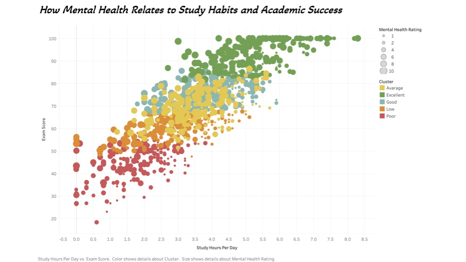
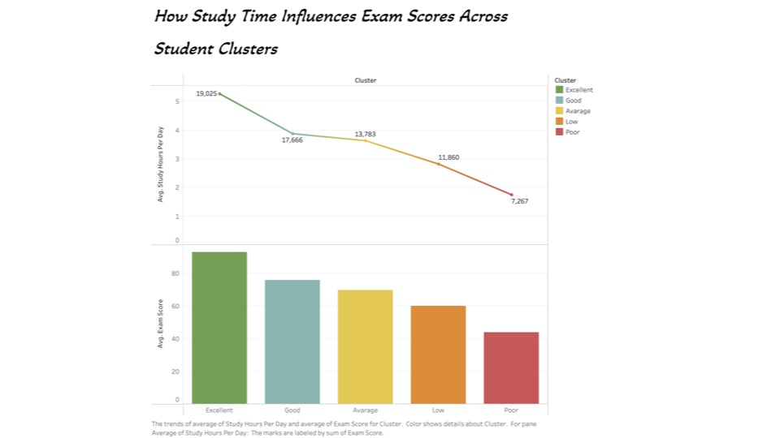
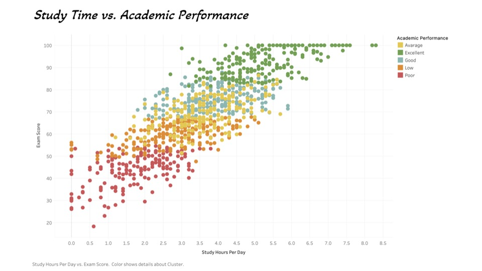

# Student Performance Clustering & Behavioral Insight Dashboard

## Overview
This project explores how behavioral patterns such as study time, sleep habits, mental health, and digital consumption influence academic performance among students. By applying clustering techniques and developing visual analytics in Tableau, I uncovered key insights that could guide student support strategies, time management plans, and even AI-driven educational recommendations.

## Tools & Technologies
- **AI Studio (Altair 2025)**: For data cleaning, correlation analysis, and K-Means clustering  
- **Tableau**: For creating interactive, professional-grade data visualizations  
- **Python & Pandas**: (for optional preprocessing & exporting cluster data)  
- **Excel**: (for data formatting)

## Key Objectives
- Identify distinct behavioral clusters among students
- Analyze the correlation between study hours and exam scores
- Explore how mental health impacts academic performance

---

## Process Summary

### 1. Data Ingestion & Cleaning
- Imported a CSV file with variables including study time, mental health, sleep hours, exam score, and attendance.
- Removed irrelevant fields and converted necessary columns to numerical types.

### 2. Correlation Analysis
- Used RapidMiner's Correlation Matrix to identify variables with the highest impact on `exam_score`.
- Top factors included `study_hours_per_day`, `attendance_percentage`, and `mental_health_rating`.

### 3. K-Means Clustering
- Performed K-Means clustering (k=5) to classify students into behavioral performance groups.
- Assigned human-readable labels: **"Excellent"**, **"Good"**, **"Average"**, **"Low"**, **"Poor"**

### 4. Tableau Visualizations
- **Scatter Plot**: Exam Score vs. Study Hours, colored by cluster.
- **Combo Chart**: Cluster-wise Avg. Study Hours (bar) vs. Exam Score (line)
- **Bubble Plot**: Mental Health vs. Study Hours & Exam Score

---

## Key Insights
- **Study 3.5–4.5 hours/day** = peak exam performance
- **Strong mental health** correlates with better scores and higher attendance
- **High Netflix/social media use** is linked to lower sleep duration, especially in low-performing clusters
- Behavioral clustering revealed meaningful groups that can benefit from targeted interventions

---

## Portfolio Value
This project demonstrates my ability to:
- Use clustering and correlation to analyze human behavior
- Build and interpret multi-dimensional Tableau dashboards
- Translate raw data into visual storytelling and actionable insights
- Work across platforms (RapidMiner, Tableau, GitHub)

---

## Interactive Dashboard (Optional)
> [View on Tableau Public](#)

---

## Screenshots

### 📊 Dashboard Overview

### 🔍 Study Hours vs Exam Score (Clustered)

### 💬 Mental Health vs Academic Performance

